# 🎥 **StreamOracle**

StreamOracle is a movie recommendation web application that blends **advanced AI search capabilities** with a visually immersive, Netflix-like user interface. Discover movies by describing your preferences, watch trailers, and explore categorized movie lists, all in a sleek, responsive design.

---

## ✨ **Features**

### 🔮 **AI-Powered Movie Recommendations**

- **Search by Description:** Describe your ideal movie, and let AI recommend perfect matches.
- **AI Integration:** Leverages advanced APIs to deliver high-quality, relevant suggestions.
- **Multi-Language Support:**
  - 🌍 Supports English, Hindi, French, and Spanish.
  - Dynamic placeholders and buttons adapt to the selected language for a localized experience.

### 🎞️ **Dynamic Movie Lists**

- **Categories:** Curated lists like _Now Playing, Popular, Top Rated,_ and _Upcoming._
- **Real-Time Data:** Powered by the TMDB API to ensure content is always up-to-date.
- **Netflix-Inspired Design:** Elegant and user-friendly.

### 📽️ **Responsive Trailer Playback**

- **Background Trailers:** Enjoy cinematic movie trailers dynamically playing in the background.
- **Adaptive UI:** Trailers are responsive and maintain visual appeal across devices.

### 🎨 **Customizable UI**

- **Dark Theme:** A Netflix-inspired dramatic design with vibrant overlays.
- **Responsive Design:** Built using **Tailwind CSS** for a seamless experience on all devices.

### 🔒 **User Authentication**

- **Secure Access:** Firebase Authentication ensures a safe and secure user experience.
- **Session Management:** Real-time session updates using Firebase.

### ⚡ **Redux Integration**

- **State Management:** Efficient handling of movie data, authentication, and AI recommendations.
- **Optimized Performance:** Memoized selectors prevent redundant API calls.

---

## 🚀 **Hosting Implementation**

### **Frontend: Firebase Hosting**

- **Deployment:** The frontend (React app) is hosted on **Firebase Hosting** for fast, global delivery.
- **Custom Domains:** Accessible via:
  - `https://stream-oracle.web.app`
- **SPA Support:** Configured to serve `index.html` for all routes, enabling seamless navigation in a single-page application.

### **Backend: Netlify Functions**

- **Serverless Functions:** Backend logic (e.g., TMDB and Gemini API calls) is handled by **Netlify Functions**.
- **Local Development:** Netlify Dev simulates the production environment locally for testing.
- **CORS Handling:** Functions are configured to allow requests from the Firebase frontend domains.

---

## 🛠️ **Core Components**

### 🔎 **AiSearchBar**

- **Interactive Search:** Describe your movie and get AI-powered recommendations.
- **Overflow Fix:** Smooth user experience with no text overlap.

### 🎥 **AiMovieSuggestions**

- **Reusable Components:** Displays AI-recommended movies in a polished design.
- **Visual Appeal:** Includes gradient borders, soft shadows, and responsive dimensions.

### 🖥️ **MainContainer**

- **Unified Layout:** Combines dynamic trailers with overlay movie details for a cohesive experience.

### 🎬 **MovieList and MovieCard**

- **Dynamic Rendering:** Interactive cards for categorized movie lists.
- **Scroll Optimization:** Smooth horizontal scrolling without layout glitches.

### 📺 **BackgroundVideo**

- **Trailer Integration:** Dynamically fetches and plays movie trailers.
- **Full-Screen Experience:** Trailers seamlessly fill the entire viewport.

---

## 🚀 **Technologies Used**

| **Frontend** | **Backend**             | **APIs**   | **State Management** |
| ------------ | ----------------------- | ---------- | -------------------- |
| React        | Firebase Authentication | TMDB API   | Redux Toolkit        |
| Tailwind CSS | Firebase Hosting        | Gemini API | React Redux          |
|              | Netlify Functions       |            |                      |

---

## 🎯 Screenshots

### Main Page

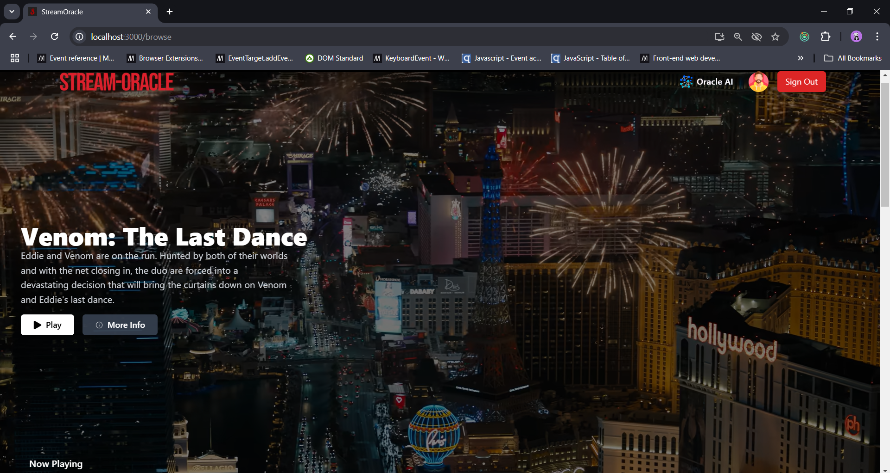
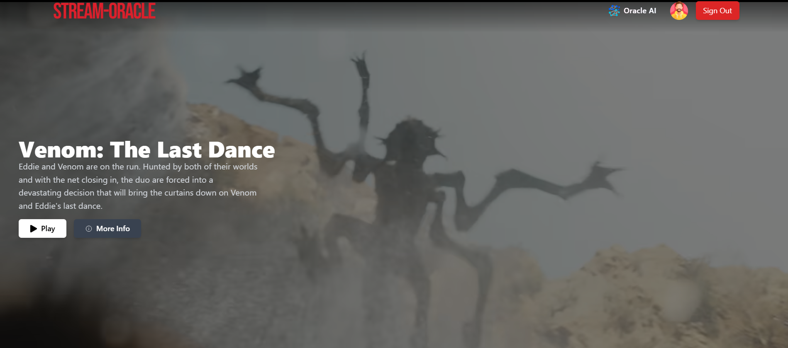
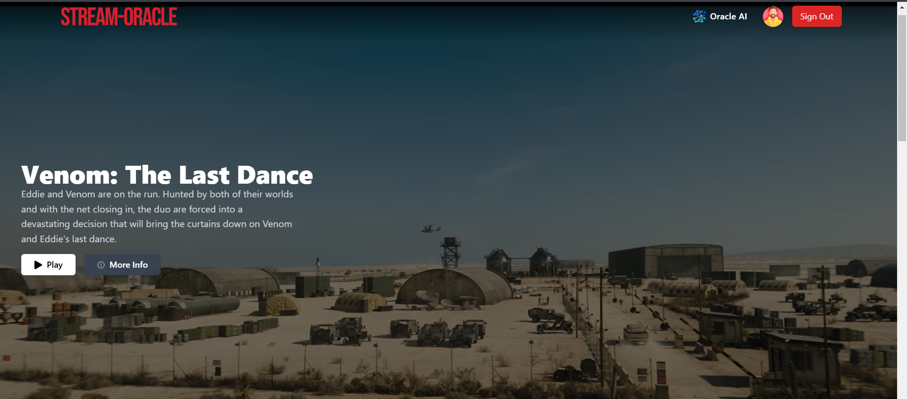
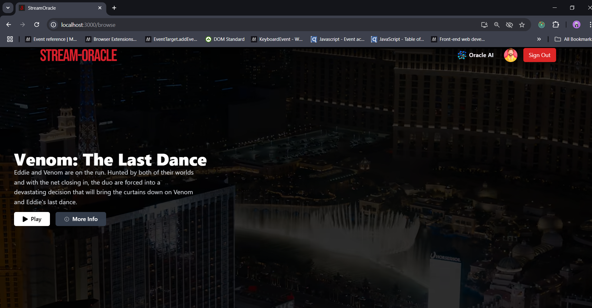
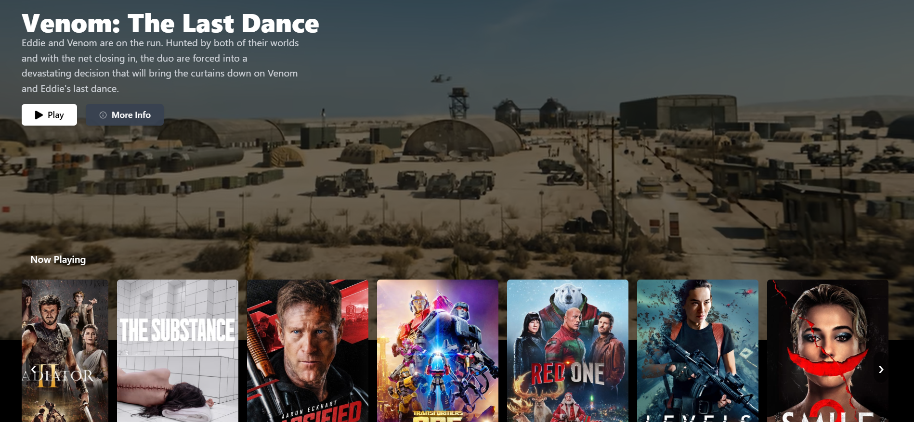
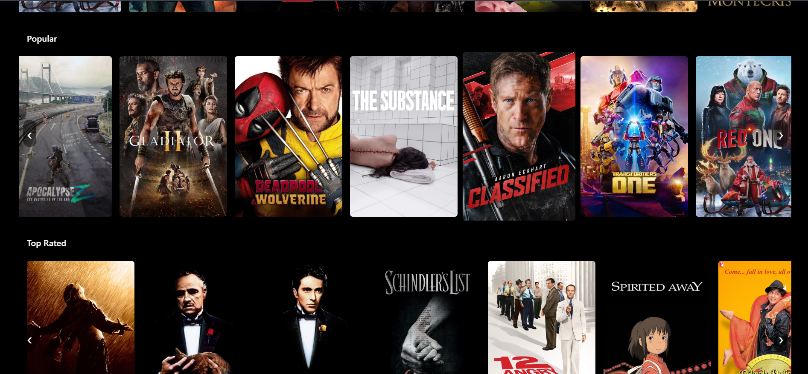
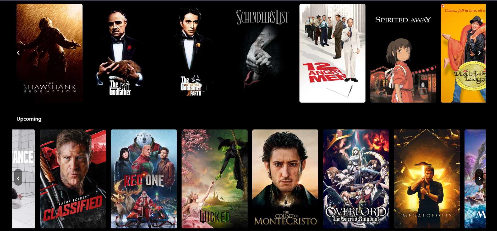

### 🎬📄Movie details page

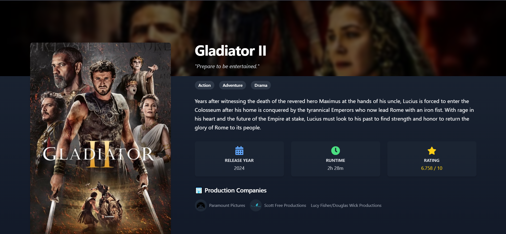

### 🤖🎥 AI Movie Recommendations

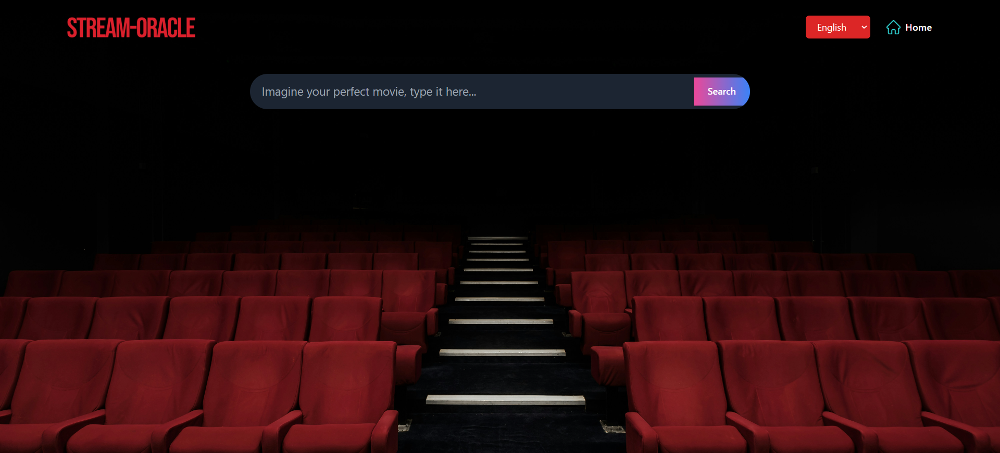
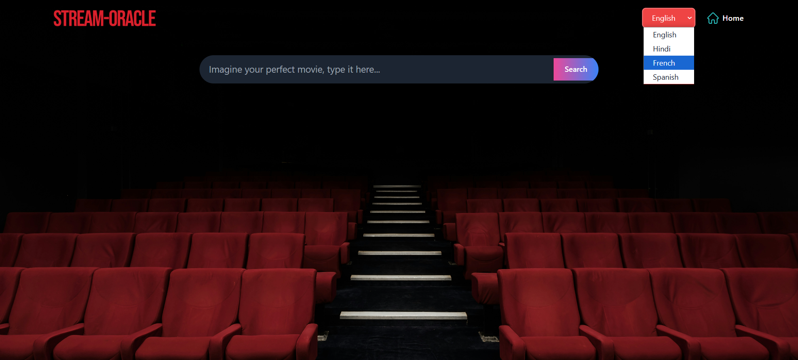
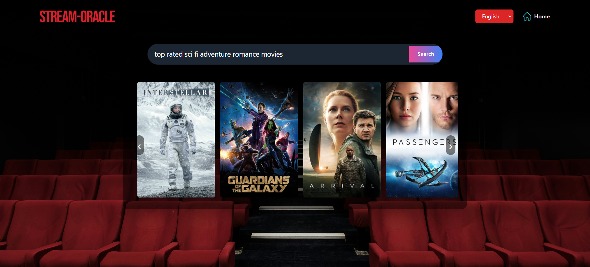

### 📱 Mobile View

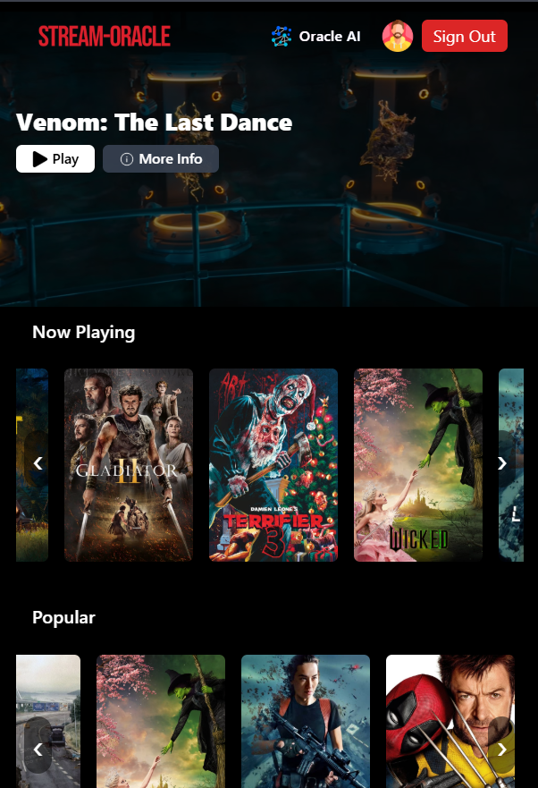
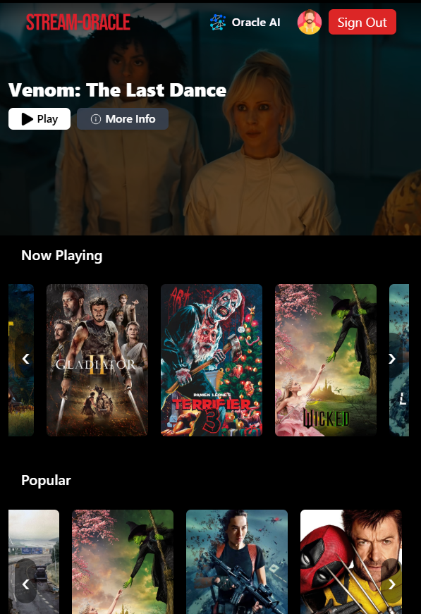
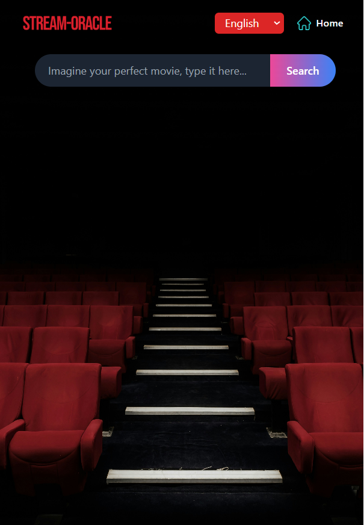
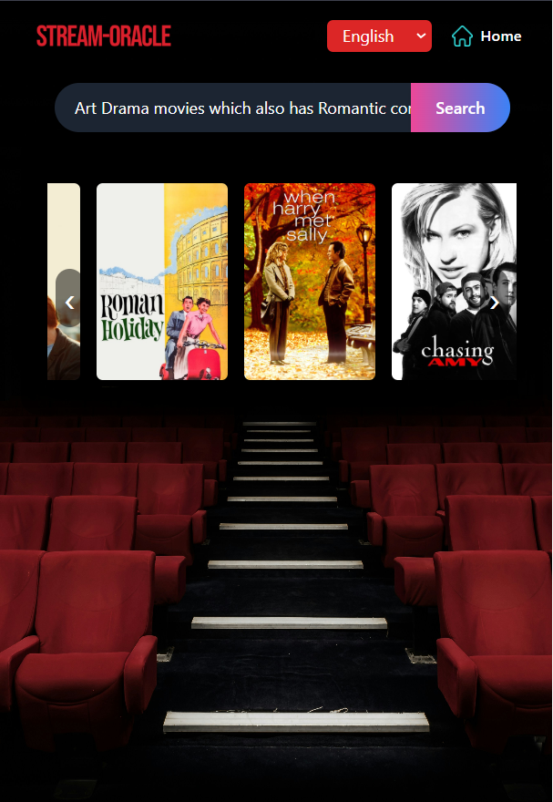

Made with ❤️ by Vivek Patidar.
